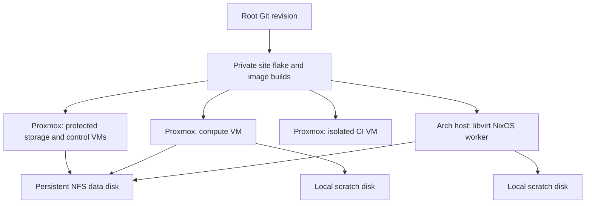

# Declarative laboratory infrastructure

The cluster has one authoritative source checkout, the `qcl-negf` root repository. Its pinned
component revisions build the same solver and application packages for every host. A private site
flake supplies measured host resources, addresses, disks, SSH public keys and artifact inputs.
OpenTofu creates VMs; NixOS defines their operating systems and services; AiiDA owns scientific
provenance; Slurm allocates compute resources.



The NFS service runs inside its own NixOS VM on the primary Proxmox server. No package or scientific
service is installed into the Proxmox host OS. The existing Arch installation remains the hypervisor
for a NixOS guest. CI uses a separate bridge/subnet and has no production secrets or mount of
scientific data.

## Resource budgets

The primary example describes a nominal 64 GiB, 32-logical-CPU host. It assigns storage 4 GiB/2
vCPU, control 8 GiB/4 vCPU, compute 32 GiB/20 vCPU and CI 8 GiB/4 vCPU: 52 GiB and 30 vCPU in total.
Replace these values with the machine's usable RAM and the needs of other guests. OpenTofu variable
validation rejects allocations exceeding the declared host budgets and reserves; it does not infer
available capacity from Proxmox.

For dedicated CI, `build_profile = "standard"` selects the shared
`ops/build-profiles.json` contract: 4 vCPU/8 GiB, one Nix build, and an aggregate
4-CPU/7-GiB slice with no swap. `"burst"` selects 12 vCPU/24 GiB and an aggregate
12-CPU/22-GiB slice, also one build and no swap. Set the same
`qclNegf.builder.profile` in the CI OS; OpenTofu requires CI CPU/RAM to match
the selected profile. The default `build_profile = null` retains custom site
resources. It does not enable the NixOS builder module.

Each VM's `started` and `on_boot` default to `true`. Burst requires both fields
to be `false` on compute. The declared CPU/RAM budget includes any VM started
now or on host boot; a stopped compute VM keeps its identity, disks and resource
declaration. Before applying a burst plan, verify actual compute is off, the
Slurm queue is empty, CI has no active build/job, and measured host memory leaves
8 GiB for the host plus the maximum 8 GiB pnetlab guest allocation. A missing
controller/compute pair is admissible only when the host inventory confirms
both are undeployed; an unreachable existing controller is a refusal. These
runtime facts are not proved by variable validation. The
[read-only snapshot admission helper](build-admission.md) validates collected
facts without collecting them or applying changes. Switch only between idle
builds, review the saved plan and guest limits after reboot, and restore standard
before starting compute. This procedure does not stop or cancel running work.

The Arch worker defaults to 30 GiB and 12 vCPU on a host with 32 GiB and 12 logical CPUs/6 physical
cores. This leaves a nominal 2 GiB outside the guest before QEMU overhead. Ansible requires
at least 1 GiB of measured host RAM beyond the guest allocation; firmware reservations mean
Linux may report less than the nominal 32 GiB. All twelve logical CPUs
are available to the guest and shared with the host scheduler; no logical CPUs are reserved solely
for Arch. Twelve vCPU are logical execution contexts, not twelve physical cores. The root disk defaults to
32 GiB and scratch to 512 GiB. Their configurable sum is capped at 700 GiB, leaving space for image
files and host overhead within an 800 GB device. Check actual free space before creating sparse
volumes: declared capacity is not reserved physical space.

After boot, run `slurmd -C` inside each compute VM and copy the measured topology into the private
site's `slurm.nodes`. Use a lower `RealMemory` than observed RAM to reserve the guest OS and
services. `28672` MiB is a conservative example for the 30 GiB Arch guest, not a hardware
measurement. Reserve one process per calculation and allocate its CPUs/RAM through AiiDA.
BLAS/OpenMP defaults are one thread; Slurm cgroup v2 enforces the assigned CPU set and memory
limits. Every compute node and submission host must retain the same immutable solver store path.

## Source to provisioned VM

For a first installation without an existing builder, start with the
[platform-only official-ISO bootstrap](bootstrap.md). It does not require any
scientific artifacts. Prepare its isolated networks through the
[private host policy](host-network.md), then build the reviewed scientific
environment on that guest under the authorized finite build budget.

1. Check out a reviewed root Git revision with all submodules. Run its tests and build the
   application/solver environment. Prepare the Julia depot using the root project's preparation
   command.
2. Create a **private** site repository from `examples/private-site/flake.nix.template` and
   `site.nix.example`. The flake calls `qcl.lib.mkApplication`, `qcl.lib.mkSolver` and
   `platform.lib.mkImages`; it exports both host configurations and five QCOW2 outputs. Copy the
   root command's generated `solver-depot.json` into the private site. `qcl.lib.mkPreparedDepot`
   verifies the archive bytes with the recorded SHA-256 before unpacking the flat depot, and checks
   its root Git revision, Julia version and Julia manifest digest against the pinned source.
   A `file://` artifact URL requires the
   archive on the build machine; generate the manifest with a real artifact HTTP URL for remote
   builders. Keep the resulting `flake.lock` with the site configuration. The private root input
   uses the Git fetcher with submodules enabled.
3. Replace the example network entries with actual, routable addresses, DNS, bridge names, VM IDs,
   SSH public keys and measured resource limits. Example addresses are documentation ranges. The
   provider never creates or reconfigures the Proxmox management bridge.
4. Copy both provider `site-base.json.example` files into the private site directory. They
   deliberately omit image hashes and paths: the build command derives those from the actual image
   bytes.

```sh
deno run --allow-read --allow-write --allow-run=nix \
  components/qcl-negf-platform/tofu/build-images.ts \
  /absolute/private-site \
  /absolute/private-site/proxmox-base.json \
  /absolute/private-site/arch-base.json \
  /absolute/private-site/generated
```

The helper builds `storage-image`, `control-image`, `compute-image`, `ci-image` and
`arch-worker-image`, finds their QCOW2 files, computes SHA-256 with Nix, and writes provider input
JSON plus an image manifest. It does not contact either hypervisor. Rebuilding updates the image
paths and digests automatically. Generated provider inputs contain site information and remain
private.

When images are built on an isolated CI VM and the administrative controller has
limited disk space, use the [host-initiated image transport](image-transfer.md).
Only metadata JSON crosses the controller; Proxmox pulls and verifies complete
QCOW2 files through restricted SSH, and the resulting provider input uses existing
`image_file_id` values. This keeps Proxmox credentials outside CI and avoids a
controller-local image copy. Local image uploads remain available for sites that
already keep their images on the administrative controller.

For a site using only the primary Proxmox server, pass `-` in place of the Arch
base JSON argument. It builds only the four Proxmox roles and does not evaluate
or generate an Arch worker artifact/provider input. The default five-role mode
remains available when that separate host is part of the site.

The image imports `modules/image.nix`: BIOS GRUB on the VirtIO root disk, an automatically resized
root filesystem, serial console, QEMU guest agent and cloud-init NoCloud networking/SSH seed
support. The root image contains the actual role configuration; first boot does not download an
unreviewed install script. Cloud-init receives only hostname, MAC-matched networking and public SSH
keys. Runtime Munge keys, runner tokens and API credentials are delivered by the site's secret
manager after provisioning, outside the Nix store and OpenTofu state.

5. Initialize and inspect the provider plans, using the generated input files:

```sh
tofu -chdir=components/qcl-negf-platform/tofu/proxmox init
tofu -chdir=components/qcl-negf-platform/tofu/proxmox validate
tofu -chdir=components/qcl-negf-platform/tofu/proxmox plan \
  -var-file=/absolute/private-site/generated/proxmox.tfvars.json

tofu -chdir=components/qcl-negf-platform/tofu/arch-libvirt init
tofu -chdir=components/qcl-negf-platform/tofu/arch-libvirt validate
tofu -chdir=components/qcl-negf-platform/tofu/arch-libvirt plan \
  -var-file=/absolute/private-site/generated/arch-libvirt.tfvars.json
```

Use the Proxmox provider's `PROXMOX_VE_API_TOKEN` environment variable and the existing SSH agent.
HTTPS certificate verification stays enabled. The image datastore must allow `import`, and the
snippet datastore must allow `snippets`; snippet uploads require the documented provider SSH access.
Libvirt uses the specified system URI and existing SSH agent. No provider configuration contains a
password or private key. Store OpenTofu state privately with backups and locking; the checked-in
provider lock files verify exact provider versions and hashes.

Apply a reviewed plan from the normal administrative environment when ready. This repository does
not apply infrastructure as part of a source or unit-test job. Changing a root image is an
infrastructure change and belongs in a reviewed maintenance plan.

### Multiple deployments on one Proxmox host

Use separate private backend state, generated inputs, saved plans and VM IDs for
each deployment. Distinct backends do not isolate remote datastore file names.
Set `resource_prefix` to a distinct, stable lowercase ASCII slug, for example
`qcl-negf-rehearsal`, when deployments share a snippet datastore. The prefix is
limited to 48 characters, starts with a letter and permits single hyphen
separators. It namespaces both cloud-init files for every role:
`PREFIX-ROLE-user-data.yaml` and `PREFIX-ROLE-network.yaml`.
The default `qcl-negf` preserves all existing file names. Changing the prefix of
an existing deployment is a reviewed resource migration, not a routine cleanup.
Image file names and protected disk lifecycle retain their existing contracts.

The VM resources start newly created guests during apply unless their inventory
sets `started = false`. Capacity admission
must therefore account for all other running deployments before apply;
sequential health verification does not make VM startup sequential. Provider
resource checks budget only the four VMs in the current inventory.

Use the published owning module directory with a separate `TF_DATA_DIR` and an
absolute private backend path for each installation. Alternatively copy the
complete owning platform tree, preserving relative assets: copying only
`tofu/proxmox/*.tf` omits the shared profile JSON and is unsupported.

For a disposable rehearsal, inspect its separate state and actual VM IDs/MACs
before removing anything. Storage/control retain `prevent_destroy` and Proxmox
protection, so a generic destroy intentionally refuses their deletion. Explicit
teardown of those disposable VMs requires a reviewed lifecycle step tied to
their recorded IDs and newly created volumes; do not weaken the public guards
or operate on production state. Removing an entry from state does not remove
its remote VM or file. Delete only that deployment's recorded snippet file IDs
after their consumers are removed. SHA-addressed staged images are separately
retained artifacts and may be shared; verify all import dependencies before
removing them. Reconcile only the rehearsal state after manual lifecycle work.

## Existing Arch host

The optional `ansible/arch-libvirt.yml` installs libvirt/QEMU, starts libvirt, prepares a dedicated
image directory, grants explicitly named operators libvirt access, and verifies KVM and the selected
Linux bridge. Install the pinned `community.general` collection first:

```sh
ansible-galaxy collection install -r components/qcl-negf-platform/ansible/requirements.yml
ansible-playbook -i /absolute/private-site/inventory.ini \
  components/qcl-negf-platform/ansible/arch-libvirt.yml --check
```

The playbook deliberately uses the existing network manager and bridge. Configure a bridge to the
wired laboratory LAN through that manager before running it. A NAT-only default libvirt network is
unsuitable for this worker topology: the controller and other cluster nodes need direct
reachability. Keep Arch's package database and installed system consistent using its normal
full-system maintenance process. The playbook does not reinstall Arch, repartition disks, change
host addresses or perform a distribution upgrade.

## Storage and failure boundaries

- **Storage VM:** a separate `qcl-data` VirtIO disk mounted at `/srv/qcl-negf`; only its `jobs`
  directory is exported to an explicit NFSv4 client allowlist. NFS waits for the persistent mount
  and cannot silently export a directory on the OS disk.
- **Control VM:** a separate `qcl-state` disk holds PostgreSQL, the AiiDA profile/file repository
  and Slurm controller state. Services depend on the state mount. The NFS main data directory is
  mounted from the storage VM.
- **Workers:** `/scratch/qcl-negf` is on a separate local scratch disk, owned by the scientific
  UID 3000. The runner executes there and publishes completed verified results to the shared job
  directory. Local incomplete results are not automatically resumed.
- **CI VM:** the root repository is the default runner registration. This VM has its own resource
  cap and network; it receives no scientific storage credentials.

Formatting is disabled by default. For an explicitly new, empty disk only, set the site's
`initializeBlankDisks = true` for its first installation. NixOS then uses systemd's make-filesystem
operation, which skips a device that already has a filesystem signature. Set it back to `false`
after initialization. Keep disks identified by stable VirtIO serial IDs; do not point a data option
at `/dev/vda` or an arbitrary device name. A missing persistent disk is a boot/service failure, not
a signal to allocate fresh scientific storage.

On Proxmox, the provider models VM disks inside a VM resource. Storage and control therefore have
**both** `prevent_destroy` and Proxmox VM protection. Their root and data disks are physically
separate, but automatic whole-VM recreation is intentionally blocked. To perform a clean OS
installation, stop submissions and services, back up the data, retain the protected VM identity/data
disk, boot reviewed rescue media and run `nixos-install` against only a prepared replacement root
disk. Never run installation against the data or state disk. Alternatively, restore the data disk
onto a newly reviewed VM after explicit detach/reattach in a maintenance procedure. Do not remove
protection to make an unexpected replacement plan succeed. NixOS `test`/`switch` deployment remains
available for ordinary configuration changes.

The Arch scratch volume and its libvirt pool are independent resources with `prevent_destroy`; they
survive guest root-image replacement. Proxmox compute scratch is worker-local disposable capacity
and may be lost when that compute VM is replaced. Finished scientific results remain on NFS. If
incomplete local work must survive maintenance, copy it explicitly before replacing a worker.

The 1 Gb LAN is suitable for control traffic and publishing results. Keep iterative solver I/O on
local scratch to avoid turning NFS latency or link saturation into solver work. Storage and
controller remain single points of availability. Back up the NFS dataset separately, and take
coordinated PostgreSQL plus AiiDA-repository backups with writes paused. A VM snapshot is not a
substitute for an application-consistent recovery test.

## Validation

Run `tofu fmt -check`, `tofu init -backend=false` and `tofu validate` in both provider directories;
`init` and `validate` need no hypervisor credentials and do not create VMs. Provider validation does
require local plugin IPC. Run Ansible `--syntax-check`, TypeScript checking for
`tofu/build-images.ts`, and the infrastructure test in `tests/infrastructure`. The NixOS `slurm-vm`
integration check boots a dedicated storage VM, controller and worker; it verifies real Slurm
submission, independent local scratch, NFS output ownership and result persistence across controller
restart. Image expression evaluation does not prove that a built QCOW2 boots.

After provider initialization, run `tofu test -filter=tests/snippet_namespace.tftest.hcl`
in `tofu/proxmox`. Its plan-only mocked provider checks unchanged default snippet
names, disjoint rehearsal names on the same datastore and invalid-prefix
rejection. It neither calls Proxmox nor establishes VM boot or remote cleanup.

Primary interfaces are pinned to
[bpg/proxmox 0.114.0](https://github.com/bpg/terraform-provider-proxmox/tree/v0.114.0/docs),
[dmacvicar/libvirt 0.9.9](https://github.com/dmacvicar/terraform-provider-libvirt/tree/v0.9.9/docs),
and the platform's Nixpkgs lock. The libvirt configuration uses the current 0.9 attribute-based
schema, including a separately uploaded cloud-init ISO; it does not use removed 0.8 block syntax.

The main `tofu/proxmox` configuration declares a local backend. Initialize it
with an absolute private state path, for example
`tofu -chdir=tofu/proxmox init -backend-config=path=/private/site/state/proxmox.tfstate`.
Keep that directory mode0700 and state/plan files mode0600; neither belongs in
the public checkout. For an existing initialized working directory, review the
state migration explicitly before using `init -migrate-state`; do not silently
create a second empty state. Offline syntax/provider validation uses
`init -backend=false` and does not establish the production backend.
